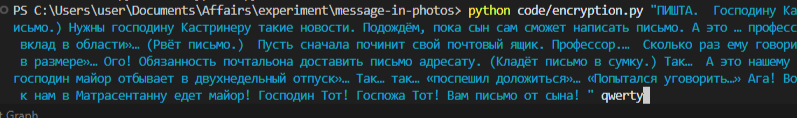
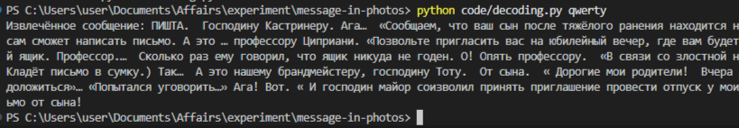
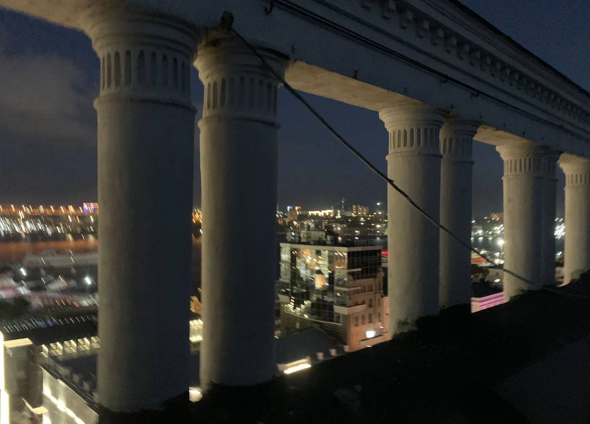

# message-in-photos
---

**message-in-photos** — это инструмент для скрытого внедрения текстовых сообщений в изображения с использованием шифрования. 
Вы можете закодировать секретное послание в обычную фотографию и позже расшифровать его с помощью ключа.

---

## Как это работает

### Шифрование
Вы выбираете изображение и текст. Программа встраивает зашифрованное сообщение в пиксели фото, не меняя его визуального восприятия.

  

### Дешифровка
Чтобы извлечь скрытое сообщение, нужен **ключ**.

  

### Пример работы

| Оригинал | Закодированное изображение |
|----------|----------------------------|
|  |  |

> На глаз различий нет.

---
